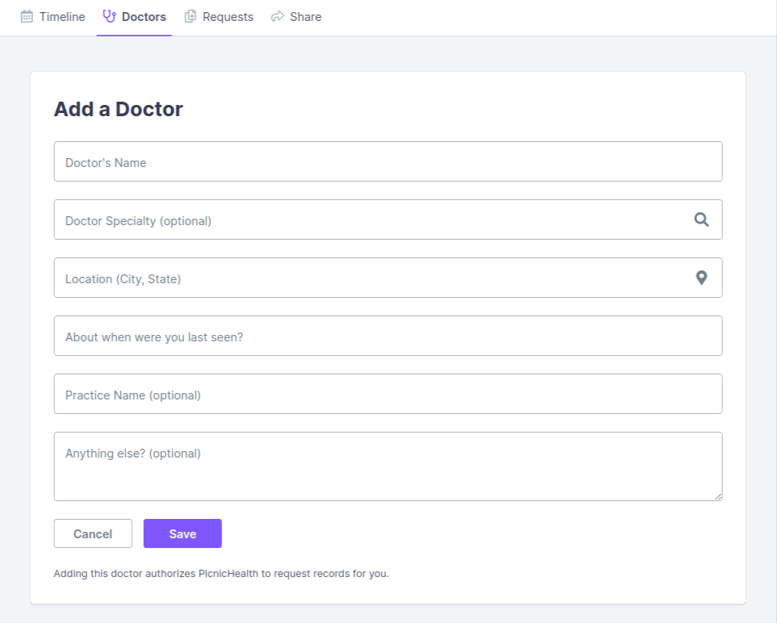
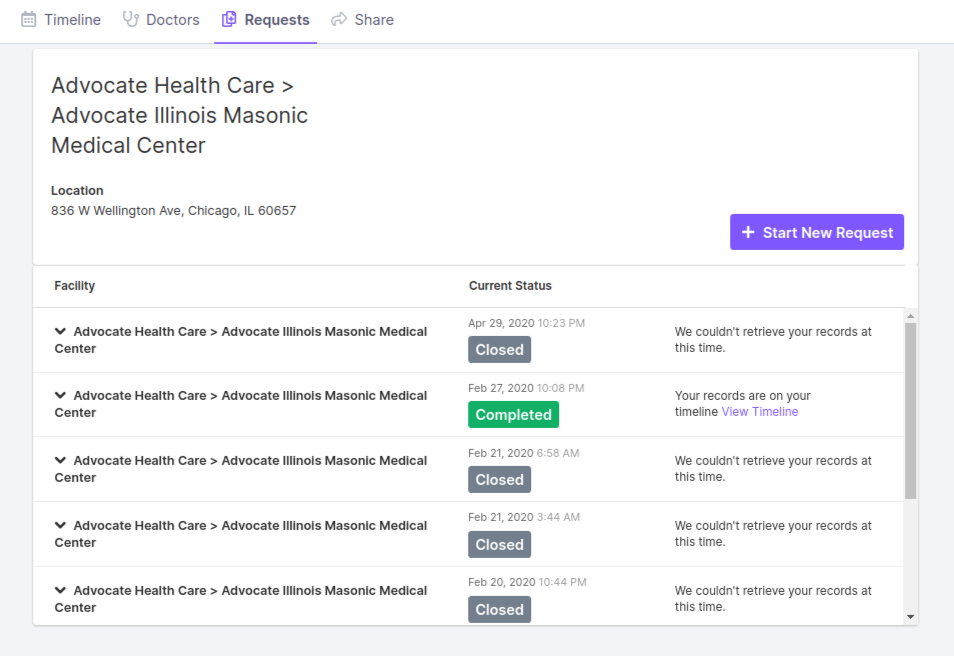

# Vivid Care Platform expected UI features

Create a Basic set of UI/UX designs for the **Vivid Care** web and mobile, the UI/UX must have the following functionalities:

## User accounts

- Signup/login
- Dashboard/Timeline
- Doctors board
- Requests board
- Share Timeline

### **Signup/login**

- As a user, I want to create an account for the application by entering my name, email address, a password and a username so that I can start using the application. 
- As a user, I want to log in using my account name and password so that I can start using the application. 
- As a user, I want to change my account details so that I can keep my account details up-to-date.
- As a user, I want to delete my account so that account information and health records are no longer stored. 
- As a user, I want to get a password reminder by email so that I can get back to using the application when I've forgotten my password.

### **Dashboard/Timeline**

- As a user, I want to see my recent **Hospital/Lab Visitation:**
  - **Date**
  - **Visit Type**
  - **Visit Details**
  - **Facility**
  - **Doctor**
  
- As a user, I want to be able to filter my timeline by 
  - **Date**
  - **Visit Type (e.g. Office Visit, Hospitalization, Procedure, Genetic Testing, Labs, Imaging, Pathology, etc)**
  - **Visit Details (e.g. Notes, Medications, Assessments, Vaccinations, Vital Signs)**
  - **Facility (e.g. name of laps/hospital visited)**
  - **Doctor (e.g. name of doctor)**
- As a user, I want to be able to download my health record in a **PDF** format.

### **Doctors Board**

- As a user, I want to be able to add Doctors and Facilities I have visited

**Add Doctors and Facilities Board samples**

**Add Doctors samples**

**Add Facilities samples**

### **Requests Board**

- As a user, I should be able to request my health record from the facility I visited
- As a user, I should be able to view my past request status, either successful or not
- As a user, I should be able to add new facility/doctor from the request board if they don't exit

**All Requests Board sample**

**Open Requests Board sample**

**Details of a past request sample**

**Request a records form sample**

### **Share Board**

- As a user, I should be able to share my medical records with providers and family.
- As a user, I should be able to see recent providers / family I have shared my medical record with in the past, and can edit their access status (remove)
- As a user, I should be able to share my medical records with providers and family by adding their name, email, link, or by asking vivid care to assist me to send it to providers.
- Provider/ family must know my date of birth or other security options I set before the view my timeline

**Share medical record Timeline sample**

**Share medical record Timeline adding provider sample**

**Share medical record Timeline adding provider / family sample**

**Share medical record Timeline security options**

**Share medical record Timeline assist me**

